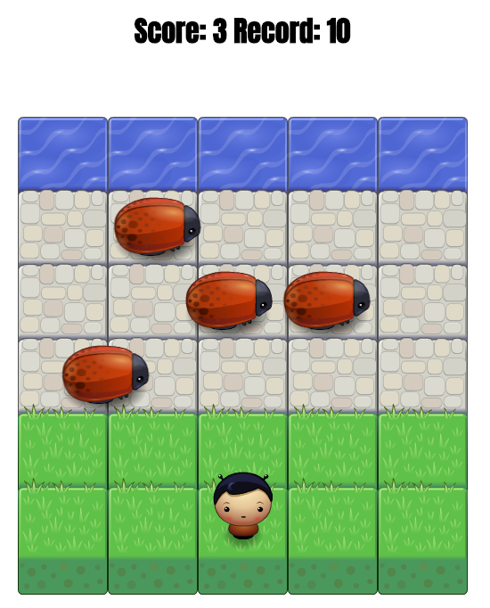

# Project: Classic Arcade Game Clone

Project created for Google Developer Challange Scholarship: Front-End Web Developer Nanodegree Program 2018.

## Description

Game created in this project is a clone of popular arcade game called [Frogger](https://en.wikipedia.org/wiki/Frogger).  
The basic concept of the game is to cross road full of traffic without being hit by enemies. Each succesfull attempt adds a point to scoreboard.

## Dependencies

Project was built without any external JS libraries or frameworks.

**Resources:**  
Font Anton used in project comes from https://fonts.google.com/.

## Run && Play

In order to run the game just open index.html file in your web browser.  

**Player controls**:  
* Arrow Up - Moves player one field up
* Arrow Down - Moves player one field down
* Arrow Left - Moves player one field to the left
* Arrow Right - Moves player one field to the right

Player wins the game when the water is reached without being hit by enemies. Succesful attempt adds a point to score. Failure resets current score.

## Screenshots

